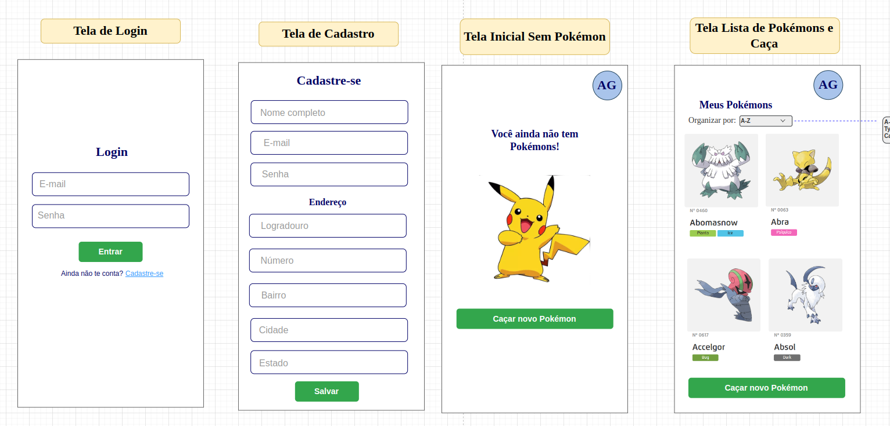
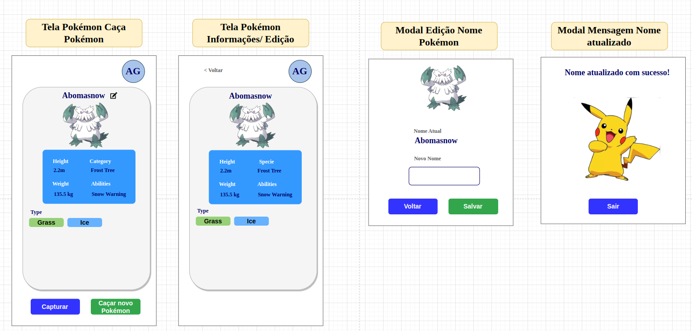

# Teste de Login, Cadastro e Caça de Pokémons

Este projeto consiste em um teste de implementação de funcionalidades de login, cadastro e um mini jogo de caça de Pokémons.

## Planejamento Inicial

O projeto foi planejado com as seguintes telas:

1. Tela de Login
2. Tela de Cadastro
3. Tela de Jogo de Caça de Pokémons

### Layout Responsivo

O layout foi criado priorizando a experiência do usuário em dispositivos móveis.Porém, a responsividade foi desenvolvida para Tablet e Desktope tenham a mesma experiência.

## Imagens Layout Inicial

Aqui estão algumas capturas de tela das telas do projeto:

1. 

2. 

## Como Utilizar

1. Clone este repositório para o seu ambiente de desenvolvimento.
2. Abra o projeto em seu editor de código preferido.
3. Abra o projeto da pasta front-fulltack-chalenge em um servidor local ou emulador para visualizar as telas.
4. Para criar um novo cadastro será necessário autorizar o e-mail do cadastro em: https://bff-ms-fullstack-778f0df92c20.herokuapp.com/api/bffmsfullstackchalenge/docs#/api/postV1FullstackchalengeWhitelistEmail
5. Experimente as funcionalidades de login, cadastro e jogo de caça de Pokémons.

## Tecnologias

- NextJs
- Styled Components
- Typescript

## Link Front

https://fullstack-challenge-c788d5a65abf.herokuapp.com/login

## Link do Back

https://bff-ms-fullstack-778f0df92c20.herokuapp.com/api/bffmsfullstackchalenge/docs

## Run Application

How to run the application

```
npm run dev
```

## Autor

Amanda Conceição Gomes
